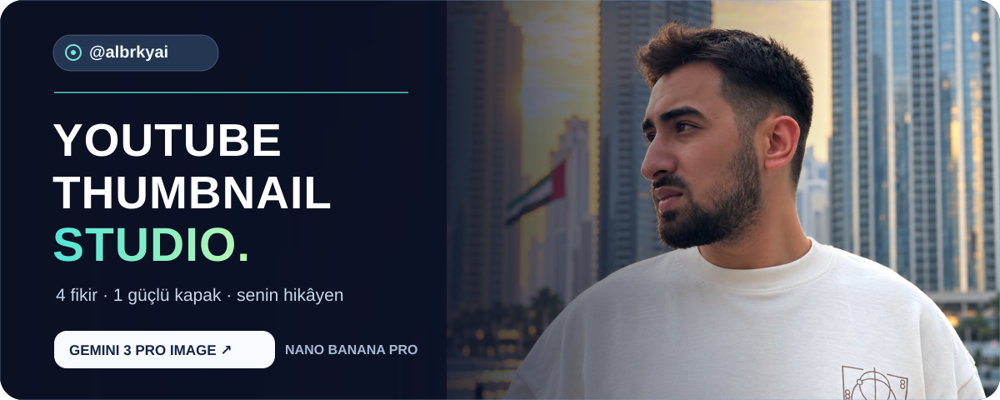
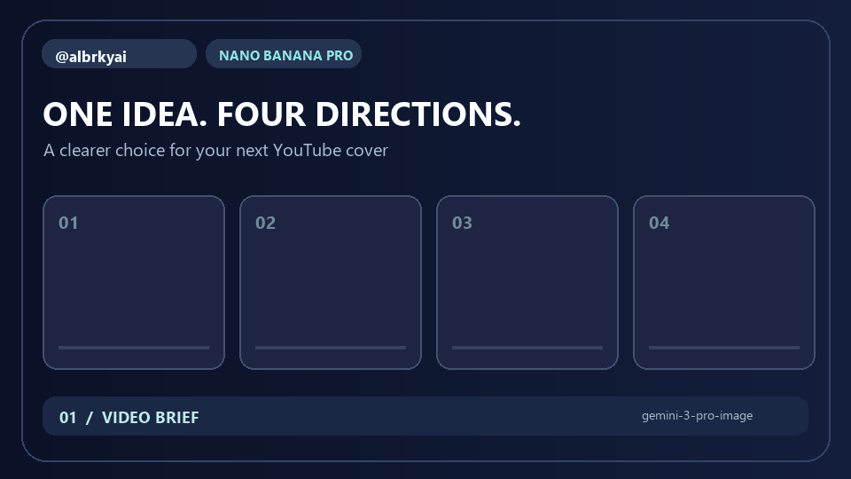

<div align="center">



# YouTube Thumbnail Studio

**Tek fikirden dört ayrı kapak konsepti.** Gemini 3 Pro Image ile üret, yan yana karşılaştır, seçtiğin yönü geliştir.

[Kurulum](#hızlı-başlangıç) · [Nasıl çalışır?](#nasıl-çalışır) · [Instagram](https://instagram.com/albrkyai/)

</div>



> **Demo notu:** Yukarıdaki GIF, iş akışını anlatan temsili bir animasyondur. Gemini çıktısı veya gerçek bir kullanıcı fotoğrafı değildir.

## Neler yapıyor?

- Bir video fikri için **A / B / C / D** olarak dört farklı görsel yön öneren bir Claude Code skill'i.
- Kendi portre fotoğrafını, önceki tasarımı ve isteğe bağlı referans görsellerini Gemini'ye gönderen üretim betiği.
- YouTube'daki başarılı örnekleri isteğe bağlı olarak bulan ve indiren yardımcı betik.
- Dört çıktıyı tek bir **2×2 karşılaştırma görselinde** birleştiren yardımcı betik.

**Model:** `gemini-3-pro-image` (Nano Banana Pro). Google'ın [model sayfasında](https://ai.google.dev/gemini-api/docs/models/gemini-3-pro-image) belirtilen kalıcı model kodu kullanılır.

## Hızlı başlangıç

1. Python 3.10+ kur ve bağımlılıkları yükle:

   ```bash
   python -m pip install -r requirements.txt
   ```

2. `.env.example` dosyasını `.env` olarak kopyala ve `GEMINI_API_KEY` değerini ekle. YouTube örneklerini aramak istersen `SCRAPECREATORS_API_KEY` değerini de ekle. `.env` Git'e alınmaz.

3. Portre fotoğrafını `.claude/skills/youtube-thumbnail/assets/headshots/` klasörüne koy. Fotoğraflar Git'e alınmaz.

4. Claude Code ile bu projede “YouTube videom için kapak oluştur” de; skill dört konsept oluşturma sürecini yönetir. Yalnızca üretim betiğini kullanmak istersen:

   ```bash
   python .claude/skills/youtube-thumbnail/scripts/generate_thumbnail.py \
     --headshot path/to/headshot.jpg \
     --prompt "16:9 YouTube thumbnail, bold contrast, a clear focal point..." \
     --output workspace/thumbnail.png
   ```

Windows PowerShell'de çok satırlı örnek yerine komutu tek satırda çalıştırabilirsin.

## Nasıl çalışır?

```text
Video konusu
    ↓
4 farklı konsept ve prompt
    ↓
Gemini 3 Pro Image → a.png / b.png / c.png / d.png
    ↓
2×2 karşılaştırma → seçilen tasarımın yeni sürümü
```

Arama betiği isteğe bağlıdır; Scrape Creators anahtarı olmadan da portre ve prompt ile kapak üretilebilir. `--reference` önceki tasarım veya logo, `--examples` ise stil örnekleri ekler. Üretim betiği varsayılan olarak 16:9 oranını kullanır. Ayrıntılı yöntem ve prompt şablonu [SKILL.md](.claude/skills/youtube-thumbnail/SKILL.md) içinde.

### Yardımcı komutlar

```bash
python .claude/skills/youtube-thumbnail/scripts/search_examples.py --query "AI agents" --top 5 --min-views 10000
python .claude/skills/youtube-thumbnail/scripts/combine_thumbnails.py --images a.png b.png c.png d.png --output comparison.png --labels A B C D
```

## Proje yapısı

```text
.claude/skills/youtube-thumbnail/
├── SKILL.md
├── assets/headshots/README.md
└── scripts/
    ├── generate_thumbnail.py
    ├── search_examples.py
    └── combine_thumbnails.py
assets/
├── hero.svg
└── demo.gif
```

## Gizlilik

API anahtarlarını `.env` içinde tut. Portrelerini ve oluşturulan görselleri depoya ekleme; `.gitignore` bunları varsayılan olarak dışarıda bırakır. Gemini'ye gönderdiğin fotoğraf ve referans görselleri, kullandığın API'nin koşullarına tabidir.

---

<div align="center">

Hazırlayan [@albrkyai](https://instagram.com/albrkyai/) · [Instagram'da takip et](https://instagram.com/albrkyai/)

</div>
